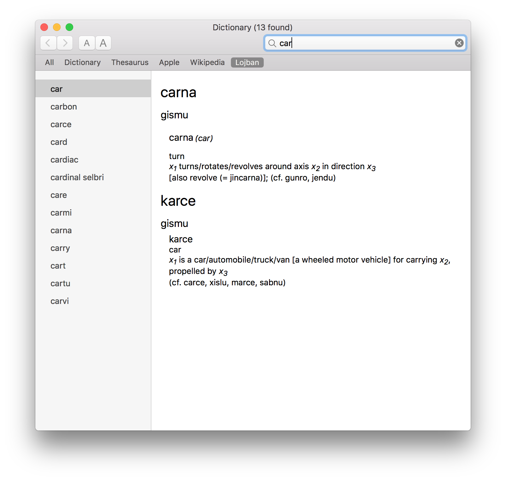

# Lojban for Dictionary.app

This is a program to generate a Lojban/English dictionary for the macOS Dictionary.app based on the lojban.org official word lists.



# Setup

To build the dictionary, you need to get the Dictionary Development Kit.
You can find it at https://developer.apple.com/download/more/, under the name "Auxiliary Tools for Xcode 7."
Then you should set the `DICT_BUILD_TOOL_DIR` variable in the makefile to the location where you installed it.

# Building and Re-Building

In order to build the content of the dictionary, use

```
make all
```

To copy the dictionary into the proper location, use

```
make install
```

The dictionary will not reload if Dictionary.app is still open, so close it before running make install.
My preferred
